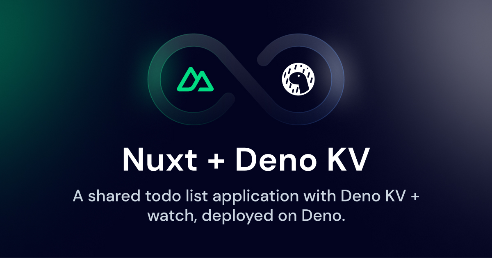

# Nuxt Guestbook

[](https://nuxt-guestbook.pages.dev)

A demonstration using [Nuxt](https://nuxt.com) with server-side rendering on the edge, authentication and database querying using SQLite in production.

Demo: https://nuxt-guestbook.pages.dev

## Features

- [Server-Side Rendering on the Edge](https://nuxt.com/blog/nuxt-on-the-edge)
- Authentication backed-in using [nuxt-auth-utils](https://github.com/Atinux/nuxt-auth-utils)
- Leverage SQLite as database with migrations using [drizzle ORM](https://orm.drizzle.team/)
- User interface made with [Nuxt UI](https://ui.nuxt.com) and [Nuxt UI Pro](https://ui.nuxt.com/pro)

## Setup

Make sure to install the dependencies using [pnpm](https://pnpm.io/):

```bash
pnpm i
```

Create a [GitHub Oauth Application](https://github.com/settings/applications/new) with:
- Homepage url: `http://localhost:3000`
- Callback url: `http://localhost:3000/auth/github`

Add the variables in the `.env` file:

```bash
NUXT_OAUTH_GITHUB_CLIENT_ID="my-github-oauth-app-id"
NUXT_OAUTH_GITHUB_CLIENT_SECRET="my-github-oauth-app-secret"
```

To create sealed sessions, you also need to add `NUXT_SESSION_SECRET` in the `.env` with at least 32 characters:

```bash
NUXT_SESSION_SECRET=your-super-long-secret-for-session-encryption
```

## Development

Start the development server on http://localhost:3000

```bash
npm run dev
```

## Deploy on CloudFlare Pages

Create a CF pages deployment linked to your GitHub repository and select the Nuxt.js preset.

To build the guestbook in production, you need a [Nuxt UI Pro](https://ui.nuxt.com/pro) license.

### Environment variables

```bash
NUXT_OAUTH_GITHUB_CLIENT_ID=...
NUXT_OAUTH_GITHUB_CLIENT_SECRET=...
NUXT_SESSION_PASSWORD=...
NUXT_UI_PRO_LICENSE=...
```

### Build command

Set the build command to:

```bash
npm run build
```

And the output directory to `dist/`

### D1 Database

Lastly, in the project settings -> Functions, add the binding between your D1 database and the `DB` variable:


Copy the contents from `server/db/migrations/0000_absent_nightshade.sql` into the D1 console to seed the database.

## License

[MIT License](./LICENSE)
